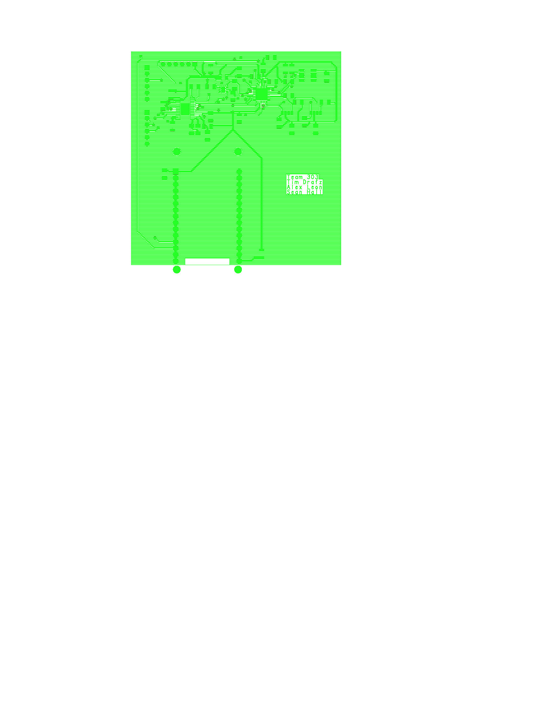
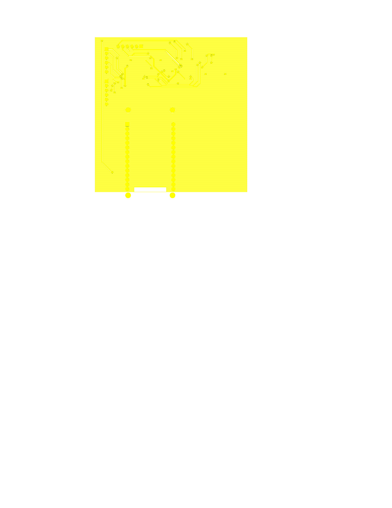
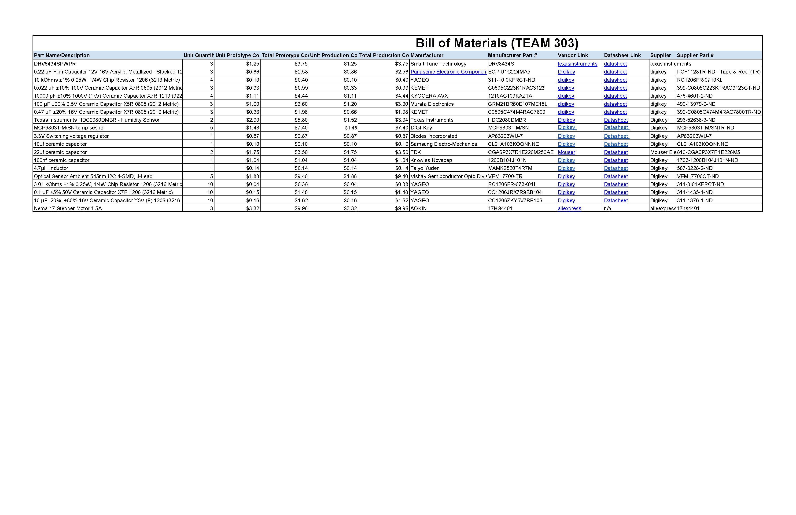

# Hardware Proposal

Here is an image of the full V2 schematic for our team's board. The name next to the subsystem is the member that is working that portion of the project. The ESP32 subsystem will be left as a team endeavour. This version removed one member who withdrew from the course, however the regulator/microcontroller subsystems are a requirement and so they remained. The other member that is not listed elsewhere is still on this document as this design was finalized before contact had been lost for a longer period of time.

Ultimately, the design changes were to make the motor controller reflect the data sheet better, and verify the regulator setup was correct. Aesthetic changes such as reducing the amount of net aliases were noted, but time did not permit that change and so this was left as-is since it is a cosmetic change for ease of reading.

_Note: The image displayed on the webpage is smaller than the actual image. Open image as a new tab for a larger image_

You can also find a full intelligent PDF file for the schematic below. This link goes to an external shared folder link for the file as markdown does not display PDF.

[PDF Schematic](https://drive.google.com/file/d/1I1el8-zNgUgV4ZWRLyxDrbo1-Ttb9qTg/view?usp=drive_link)

The images below are for the top and bottom layers of our custom designed PCB. Most components were small and took up nearly no footprint, the exception being the ESP32 module which is what drove the size to 3300 mils. When designing this, we tried to keep the components as close as possible to reduce space taken up. We also tried utilizing vias more often to aid in this compacted design. The original intent was to have the two optical sensors on opposite sides of the board to aid in tracking, but time constraints made us compromise on keeping them close by to avoid having to figure out the traces a third time. Future considerations would be to split them to aid the motor more in pinpointing major light location.

Like the schematic, a PDF can be found below. The color scheme makes it hard to see. Recommend zooming to at least 147% to see the pads and traces better.

[PDF PCB](https://drive.google.com/file/d/12rJzps9wB1NDeXYRvfX1gcweBtKxW6-P/view?usp=drive_link)

Along with all of this is a list of the Bill of Materials required to build this design.

