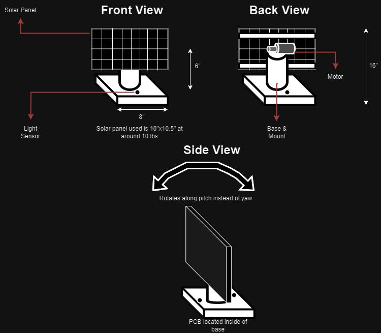
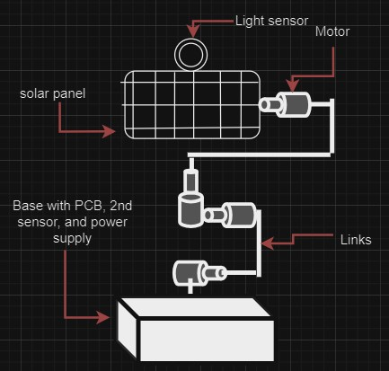

---
Main Page
---

## Team 303

**Team Members**: _Tim Drafz_ , _Alex Leon_ , _Sivanee Naghichetty_ , _Luke Jeffs_  

**Preparation Date**: 09/08/2024

**Arizona State University**  
**EGR 314**  
**Professor Nichols**

---

## Team Organization

**Mission Statement**  
Our mission is to create an environment sensing and adjusting product that can be useful to most everyday people and fulfills all the project requirements within the budget we have been given.

When drafting the team charter we focused on trying to give people responsibilities that fell within their strengths. Along with that, we wanted to make sure we discussed conflict resolution within the group so we knew what problems would require escalation to the teaching staff. When creating our goal we discussed what we wanted to get out of the class itself. A link to the page with the full charter is listed below.

[Team Charter](Charter.md)

---

## User Needs, Benchmarking, and Requirements
Our vision goes beyond achieving an 'A' or meeting the minimum course requirements. We aim to not just develop and refine our skills in embedded systems but also to create a project that future users can manage and build upon. Whether as a learning tool, a source of inspiration for their engineering projects, or even a hobby, we hope our work will have lasting value. Additionally, we have set a goal of designing subsystems that can be applied to creating a solar tracker device, capable of following the sun and storing energy efficiently. A link to our User Needs, Benchmarking, and Requirements is below.

[User Needs](UserNeeds.md)

---

## Design Ideation

